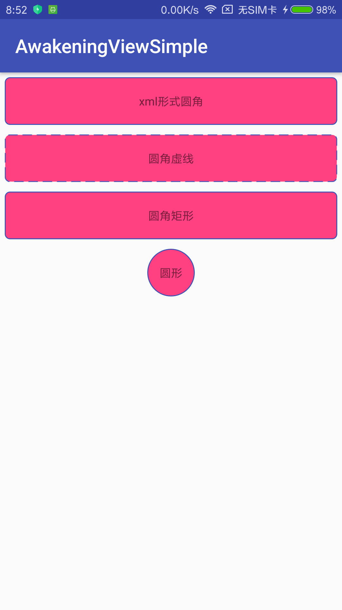

# AwakeningView
## 一行链式代码，解决各种View/Layout 圆形/圆角边框等问题


# How to
## To get a Git project into your build:
### Step 1. Add the JitPack repository to your build file
### Add it in your root build.gradle at the end of repositories:
``` 
allprojects {
  repositories {
    ...
    maven { url 'https://jitpack.io' }
  }
}
```
### Step 2. Add the dependency
```
dependencies {
  compile 'com.github.deilsky:AwakeningView:v1.1'
}
```
### Step3.Used
```
xml
<TextView
    android:layout_width="match_parent"
    android:layout_height="50dp"
    android:layout_margin="5dp"
    android:background="@drawable/corner"
    android:gravity="center"
    android:text="xml形式圆角" />

<TextView
    android:id="@+id/tv_main1"
    android:layout_width="match_parent"
    android:layout_height="50dp"
    android:layout_margin="5dp"
    android:gravity="center"
    android:text="圆角虚线" />

<TextView
    android:id="@+id/tv_main2"
    android:layout_width="match_parent"
    android:layout_height="50dp"
    android:layout_margin="5dp"
    android:gravity="center"
    android:text="圆角矩形" />

<TextView
    android:id="@+id/tv_main3"
    android:layout_width="50dp"
    android:layout_height="50dp"
    android:layout_gravity="center_horizontal"
    android:layout_margin="5dp"
    android:gravity="center"
    android:text="圆形" />

AwakeningView.RectangleBuilder.create()
        .fillColor(R.color.colorAccent)
        .strokeColor(R.color.colorPrimary)
        .strokeSize(1)
        .connerAll(5)
        .build().target(findViewById(R.id.tv_main1))
        .alpha(255)
        .dashGap(5).dashWidth(10)
        .build();
AwakeningView.RectangleBuilder.create()
        .fillColor(R.color.colorAccent)
        .strokeColor(R.color.colorPrimary)
        .strokeSize(1)
        .connerAll(5)
        .build().target(findViewById(R.id.tv_main2)).alpha(255).build();
AwakeningView.CircleBuilder.create()
        .fillColor(R.color.colorAccent)
        .strokeColor(R.color.colorPrimary)
        .strokeSize(1).build().target(findViewById(R.id.tv_main3)).build();
```

[](https://jitpack.io/#deilsky/AwakeningView)
